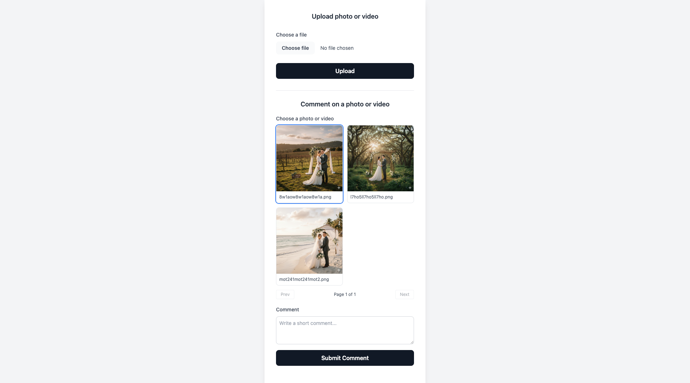
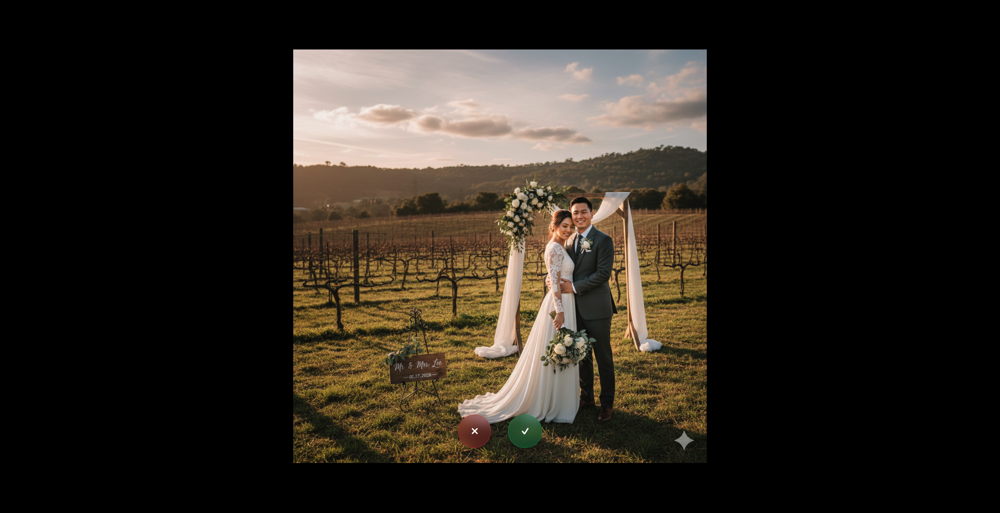
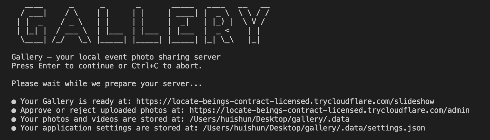

# Gallery


*Fullscreen slideshow with danmu(弹幕)-style comments*

Lightweight local gallery server for sharing photos and short videos during an event. It starts a local Gin server, opens a Cloudflare tunnel to get a public URL, and shows a fullscreen slideshow with live comments (danmu). Guests upload media from their phones; optionally, an admin can approve uploads first.

## Features
- Public upload page and fullscreen slideshow.
- Cloudflare tunnel URL and QR code for easy sharing.
- Optional admin approval flow (pending/approve/reject).
- Comments per photo/video, shown as live comments (danmu) overlay.
- Short video support with a 30s limit.
- SQLite-backed comments storage.

## Screenshots


*Upload page for guests to submit photos and short videos*


*Admin review queue to approve or reject submissions*


*CLI prompts when starting the server*

## Download and test

### macOS DMG (from GitHub Releases)
1) Go to https://github.com/huishun98/gallery/releases and download the latest `.dmg`.
2) Open the DMG and drag `Gallery.app` into Applications.
3) Launch the app and follow the prompts.

Note: the DMG is not signed, so you may see "Apple could not verify 'Gallery' is free of malware that may harm your Mac or compromise your privacy."
If that happens, you can:
- Go to System Settings -> Privacy & Security -> Security -> Open Anyway.
- Or run `xattr -dr com.apple.quarantine /Applications/Gallery.app` after moving it to Applications.

### Windows ZIP (from GitHub Releases)
1) Go to https://github.com/huishun98/gallery/releases and download the latest `Gallery-windows-x64.zip`.
2) Unzip it to a folder (for example `C:\Gallery`).
3) Run `gallery.exe` and follow the prompts.

### Docker image (from registries)
Images are published on release tags (for example `v0.1.0`).

GitHub Container Registry:
```bash
docker pull ghcr.io/huishun98/gallery/gallery:v0.1.0
docker run --rm -it -p 8000:8000 ghcr.io/huishun98/gallery/gallery:v0.1.0
```

Docker Hub (same tag):
```bash
docker pull huishun/gallery:v0.1.0
docker run --rm -it -p 8000:8000 huishun/gallery:v0.1.0
```

### Docker
If you want to build from the local `Dockerfile`, clone the repo first:
```bash
git clone https://github.com/huishun98/gallery.git
cd gallery
```

```bash
docker build -t gallery .
docker run --rm -it -p 8000:8000 gallery

# To persist data
docker run --rm -it -p 8000:8000 -v "$PWD/.data:/app/.data" gallery
```

You will be prompted for:
- Port (default 8000)
- Whether to enable admin mode (basic auth)
- Whether to enable danmu comments

When the server starts, it logs the public URL and the data directory.

## Local development

### Requirements
- Go 1.23+.
- `cloudflared` for the public tunnel.
- `ffprobe` (from `ffmpeg`) for video duration checks.

macOS:
```bash
brew install cloudflared ffmpeg
```

Debian/Ubuntu:
```bash
sudo apt install cloudflared ffmpeg
```

### Quick start
```bash
go run main.go
```

## Admin mode (basic auth)
Admin mode adds a basic-auth protected review queue. Uploads go to `media/pending` instead of the slideshow, and an admin approves or rejects each item from `/admin/review`. Approved files move into `media/media` and appear in the slideshow; rejected files move to `media/rejected`.

Default admin credentials are `admin` / `admin`. To change them, update the `settings.json` file in the data directory.

If danmu is enabled, admins can also manage comments at `/admin/comments`.

## Danmu comments
Danmu comments can be disabled during setup. When disabled, comment submission, comment browsing, and the admin comment management page are hidden and their routes are not registered.

## Routes
- `/` Upload page.
- `/slideshow` Fullscreen slideshow with QR code.
- `/admin/review` Admin review UI (only if admin enabled).
- `/admin/comments` Admin comment management UI (only if danmu enabled).

## Data storage
- Local run: `./.data` in the project directory.
- macOS app bundle: `~/Library/Application Support/Gallery` (via user config dir).

Media is stored under:
- `media/media` for approved files.
- `media/pending` for admin review (when enabled).
- `media/rejected` for rejected files.

Comments are stored in `app.db` (SQLite) under the data directory.
